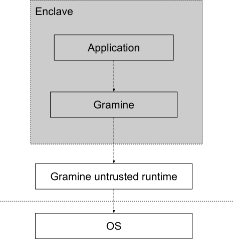
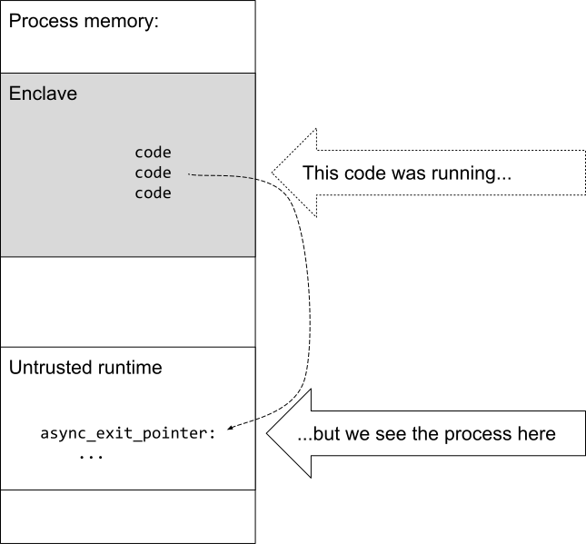

<!--
  NOTE about images: these are SVG images exported from Google Docs and then
  cropped; the `img-invert` CSS class above is for inverting colors (Gramine's
  website is white-on-black)
-->

*This is a blog post about GDB support in the Gramine project. This feature was
originally written by Chia-Che Tsai, and later expanded by me (Paweł Marczewski)
and other contributors to the project. Thanks to Michał Kowalczyk and Dmitrii
Kuvaiskii for reviewing the post.*

[Gramine](https://gramineproject.io/) is a framework for running Linux applications under non-standard
environments, such as [Intel SGX](https://en.wikipedia.org/wiki/Software_Guard_Extensions). Intel SGX is a special processor feature that
allows creating enclaves: execution environments that are isolated from the host
system. When a program runs inside an SGX enclave, its execution state and
memory cannot be changed or even viewed by other software running on the
machine - even by the host operating system.

This is a pretty unusual situation: normally, an application might not trust the
external world (for example remote hosts), but it still trusts the host OS when
it comes to basic operations like saving data in files, or sending it between
processes. However, in the case of SGX, we do not want the host to access (or
modify) our data, so performing these operations will be more complicated than
just asking the host OS.

To make sure the interactions with outside world are safe, Gramine itself acts
as an operating system, and intercepts requests (system calls) made by the
application. Handling these requests might ultimately involve talking to the
host OS, but with extra security precautions: for instance, `read` and `write`
operations might actually apply encryption on the fly, so that the data stored
on the host cannot be read without an encryption key.

The diagram below shows the architecture of Gramine. The application and Gramine
are running inside an enclave. Gramine handles application's system calls. When
necessary, it invokes the untrusted runtime, which runs outside of the enclave
and is responsible for calling the host OS.

Gramine might not be a real OS kernel, but it's still a pretty complicated piece
of software. It's really useful to have a debugger when developing Gramine and
running programs under it. However, we're not exactly running a normal Linux
program, and standard Linux tools won't work without extra effort. We managed to
get GDB running, but it wasn't easy...

## Looking inside the SGX enclave

As mentioned before, by design, there is no way to look "inside" an SGX enclave.
If we're not currently executing enclave code, memory access will not work.

For debugging purposes, the rules can be relaxed somewhat. It's possible to run
an enclave with debugging features enabled, in which case Linux will allow us to
read the enclave memory. Direct memory access still won't work, but it will be
possible to use mechanisms such as the `/proc/<pid>/mem` special file. GDB uses
`/proc/<pid>/mem`, so it can access enclave memory without problems.

(To enable debugging features, the enclave must be created with a debug bit set,
and enclave threads must additionally set the `DBGOPTIN` flag. This enables
special CPU instructions (`EDBGRD`/`EDBGWR`) which the Linux kernel can use to
read and write enclave memory).

Unfortunately, it's not that easy to check which part of the program is being
executed. Whenever the process is stopped while in enclave, the SGX hardware
forces it to exit the enclave and land on the Async Exit Pointer (AEP). Most CPU
registers are also reset to prevent data leaks. Therefore, when we examine a
stopped process with GDB, we will never see the actual location in enclave, or
any other useful information such as stack pointer.

However, if we're able to read the enclave memory (via the `/proc/<pid>/mem`
special file), we can actually find the previous position stored there, as well
as values of all the other registers.

This is actually more complicated than it sounds like, and requires some support
from Gramine. SGX saves the register values for each thread inside its TCS
(Thread Control Structure), and in order to read these values from another
process, it has to know the TCS base address for a given thread. Gramine dumps
this information (along with other necessary details about the enclave) to a
[global object](https://github.com/gramineproject/gramine/blob/ad85fe95c43fd583f7fa53a5f170383a5fcd8536/Pal/src/host/Linux-SGX/gdb_integration/sgx_gdb.h#L16) stored at a predefined address in memory.

Now, we need to make sure GDB uses that information. GDB interacts with the
process using [ptrace](https://man7.org/linux/man-pages/man2/ptrace.2.html). This is a Linux mechanism that allows, among other
things, starting and stopping another process, and reading register values while
it's stopped. Unfortunately, this is not useful if the process was stopped while
in enclave: as mentioned before, stopping the process causes it to temporarily
exit from enclave, so `ptrace` is not going to report the right location.

What we can do is intercept that mechanism: we use the [LD_PRELOAD
trick](https://stackoverflow.com/questions/426230/what-is-the-ld-preload-trick) to inject [our own wrapper for `ptrace`](https://github.com/gramineproject/gramine/blob/ad85fe95c43fd583f7fa53a5f170383a5fcd8536/Pal/src/host/Linux-SGX/gdb_integration/sgx_gdb.c#L488).
Using this wrapper, we can ensure that GDB sees the right register values.
Whenever we find the process stopped at the AEP, we read the "real" instruction
pointer and other registers through `/proc/<pid>/mem`, and return this
information to GDB. Effectively, we pretend that the process was actually
stopped *before* it exited the enclave.

As a result, the enclave code is largely transparent to GDB: we're able to see
the current location in enclave, single-step through instructions, and add
breakpoints.

## File information

Thanks to our `ptrace` wrapper, GDB knows what instructions are being executed.
However, it only sees them as raw machine code: there is nothing that says which
source lines (or even functions) these instructions correspond to. This is
because GDB has no information about binaries that are loaded inside the
enclave.

This situation is actually not that different from regular Linux programs that
use dynamic libraries. And regular programs have a standard solution for it: the
GNU C library (glibc) maintains a special structure ([r_debug](https://code.woboq.org/userspace/glibc/elf/link.h.html#37)) with a list of
currently loaded shared libraries, and GDB reads this list.

It's tempting to try using this mechanism. However, `r_debug` is already
maintained by glibc in the untrusted runtime (outside of enclave), and while we
could probably write to it, interfering with data maintained by glibc sounds
like a bad idea. And creating another `r_debug` (either in enclave, or outside)
wouldn't really work, since GDB only expects one such variable.

Instead, we implemented a similar solution ourselves: Gramine maintains [its own
`debug_map` structure](https://github.com/gramineproject/gramine/blob/ad85fe95c43fd583f7fa53a5f170383a5fcd8536/Pal/include/host/Linux-common/debug_map.h#L22) describing currently loaded binaries, and on
each change, calls a function called [`debug_map_update_debugger()`
](https://github.com/gramineproject/gramine/blob/9eafa5f7731650dc54043e4aa4804b6a2e34e292/Pal/src/host/Linux-common/debug_map.c#L37). This function is a no-op, and exists only so that
our [Python extension for GDB](https://github.com/gramineproject/gramine/blob/e37f773d4d910799a854b90334f2ff8eb6f411bd/Pal/gdb_integration/debug_map_gdb.py#L59) can set a breakpoint in it, and
read `debug_map` whenever the breakpoint is triggered.

Determining what files to add to `debug_map` is not that simple: we can easily
register binaries loaded by Gramine, but Gramine is not the only component that
loads them. Much like Linux, when Gramine executes a dynamically linked binary,
it loads only the binary itself and its [ELF interpreter](https://lwn.net/Articles/631631/) (usually a dynamic
linker called `ld-linux*.so`). Then, the dynamic linker loads all other
libraries required by the application. In addition, the application itself could
use [dlopen](https://man7.org/linux/man-pages/man3/dlopen.3.html) to load more libraries at run time.

Fortunately, both the dynamic linker and `dlopen` are usually provided as part
of the `libc` library. Gramine provides a patched version of `glibc` that [calls
`gramine_register_library()`][glibc_register] whenever it loads a new dynamic
library, and as a result is able to notify GDB whenever a new library is added.

[glibc_register]: https://github.com/gramineproject/gramine/blob/ad85fe95c43fd583f7fa53a5f170383a5fcd8536/subprojects/packagefiles/glibc-2.34/glibc-2.34.patch#L53

Having a list of all loaded binaries also turned out to be useful for other
developer features: thanks to it, Gramine can [report more details about a crash
location](https://github.com/gramineproject/gramine/blob/e37f773d4d910799a854b90334f2ff8eb6f411bd/Pal/src/host/Linux-common/debug_map.c#L282), and even help with profiling.

## Stack jumping

As said before, Gramine runs as a library, but handles operations that would
normally be system calls. This is also achieved using our patched version of the
`glibc` library: instead of running a `SYSCALL` instruction, the library [jumps
directly into Gramine](https://github.com/gramineproject/gramine/blob/ad85fe95c43fd583f7fa53a5f170383a5fcd8536/subprojects/packagefiles/glibc-2.34/glibc-2.34.patch#L80). (The application might also execute
`SYSCALL` instructions directly, and we intercept these, but this is much slower
than a simple jump).

What's important is that we cannot keep using the application's stack. Normally,
the `SYSCALL` instruction triggers entering the kernel (which sets up its own
stack), and the code containing `SYSCALL` relies on the fact that the
application's stack stays untouched. Therefore, Gramine also needs to switch to
its own stack.

Deeper layers of Gramine actually switch stacks for the second time: when
Gramine needs to run some code outside of the SGX enclave, it uses another
syscall-like mechanism called OCALL ("outside call"). The code after OCALL
cannot access the enclave memory anymore, so it needs its own stack in untrusted
(non-enclave) memory.

As a result, if we want to read a full stack trace, we might need to go through
three different places in memory: the untrusted stack, Gramine's stack, and
finally the application stack.

GDB has to understand how to move between all these stacks. This is usually done
by decorating the assembly code with [CFI directives](https://www.imperialviolet.org/2017/01/18/cfi.html), which contain exactly
this information (e.g. "in this place in the code, the previous stack frame is
saved at address `[RSP+xyz]`").

However, notice that in our case, the stack frames are not ordered: most of the
time the next stack frame is at a lower address (as is normal on x86), but when
we change stacks, we might need to jump back to a higher address. It turns out
that GDB really doesn't like this situation, and claims the stack is corrupt.
The only exception is when a function is called `__morestack` (this magic name
is actually [hardcoded in GDB sources](https://github.com/bminor/binutils-gdb/blob/2b1026f391d55070ae1e724c0770302d1c429611/gdb/frame.c#L2247)). In order for GDB to
process our stack trace correctly, we have to [pretend that the return address
is inside a `__morestack` function](https://github.com/gramineproject/gramine/blob/e37f773d4d910799a854b90334f2ff8eb6f411bd/LibOS/shim/src/arch/x86_64/syscallas.S#L155).

## In conclusion

Unfortunately, getting GDB to work with Gramine required some fighting. I
mentioned the most important parts, but I left out some more details, such as
signal handling or handling multiple threads. The end result is usable for most
scenarios, but still breaks occasionally.

Of course, we're not interfacing with GDB using any official API. An alternative
implementation could use GDB's [libthread_db](https://sourceware.org/gdb/onlinedocs/gdb/libthread_005fdb_002eso_002e1-file.html) mechanism, or perhaps the [remote
debugging protocol](https://sourceware.org/gdb/onlinedocs/gdb/Remote-Protocol.html). I think both of these are worth at least investigating.
